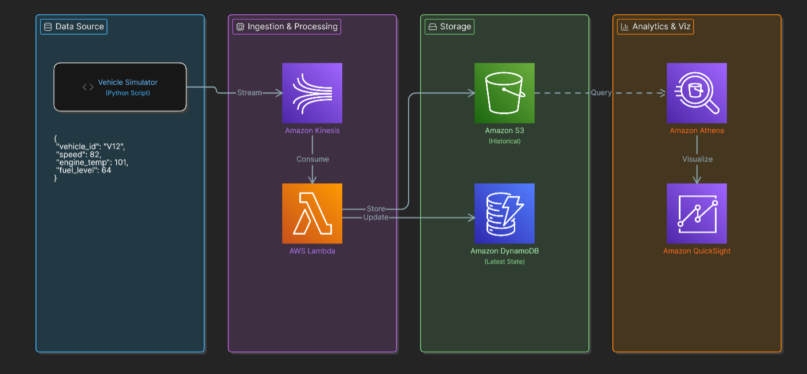

# 🚀 Enterprise Real-Time Vehicle Telemetry Platform

## 📌 Project Overview

This project simulates an enterprise-grade real-time connected vehicle telemetry platform built on AWS.

The pipeline streams live vehicle sensor data using Amazon Kinesis, processes events through AWS Lambda, stores historical telemetry data in Amazon S3, maintains latest vehicle state in DynamoDB, and enables analytics using Amazon Athena and Amazon QuickSight.

This project demonstrates real-world cloud data engineering concepts including:

- Real-time streaming
- Event-driven processing
- Historical + live data architecture
- Serverless computing
- Cloud analytics dashboards
- Data visualization
- Enterprise pipeline architecture

---

# 🏗️ Architecture Diagram



---

# 🚀 End-to-End Pipeline Flow

```text
Vehicle Simulator (Python)
        ↓
Amazon Kinesis Data Stream
        ↓
AWS Lambda Processing
        ↓
Amazon S3 (Historical Storage)
        ↓
Amazon DynamoDB (Latest Vehicle State)
        ↓
Amazon Athena Query Engine
        ↓
Amazon QuickSight Dashboard
```

---

# 🛠️ Tech Stack

| Service | Purpose |
|---|---|
| Python | Vehicle telemetry simulator |
| Amazon Kinesis | Real-time streaming |
| AWS Lambda | Event processing |
| Amazon S3 | Historical data lake |
| DynamoDB | Latest live vehicle state |
| Athena | SQL analytics |
| QuickSight | Dashboard visualization |

---

# 📂 Project Structure

```text
enterprise-real-time-vehicle-telemetry-platform/
│
├── Architecture/
│   └── architecture.png
│
├── Athena/
│   └── athena.sql
│
├── Lambda/
│   └── lambda_function.py
│
├── Simulator/
│   └── simulator.py
│
├── Dashboard/
│   └── dashboard.png
│
├── README.md
└── requirements.txt
```

---

# 🚀 Real-Time Vehicle Data Example

```json
{
  "vehicle_id": "V12",
  "speed": 82,
  "engine_temp": 101,
  "fuel_level": 64,
  "timestamp": "2026-05-09T10:15:22"
}
```

---

# 📊 QuickSight Dashboard

## 🚗 Vehicle Analytics Dashboard


Dashboard includes:

- Vehicle speed analytics
- Engine temperature monitoring
- Fuel level trends
- Real-time telemetry insights

---

# 🚀 Key Features

✅ Real-time streaming architecture

✅ Historical telemetry storage

✅ Live vehicle state tracking

✅ Serverless AWS processing

✅ SQL analytics with Athena

✅ Interactive dashboards with QuickSight

✅ Enterprise-style cloud architecture

---

# 🚀 Athena Sample Queries

## Average Vehicle Speed

```sql
SELECT vehicle_id,
AVG(speed) AS avg_speed
FROM vehicle_data
GROUP BY vehicle_id;
```

## High Engine Temperature Vehicles

```sql
SELECT *
FROM vehicle_data
WHERE engine_temp > 100;
```

---

# 🚀 Future Enhancements

- Real-time alerting system
- Predictive maintenance analytics
- Machine learning anomaly detection
- Apache Kafka integration
- Terraform infrastructure automation

---

# 👨‍💻 Author

Rohit

AWS Data Engineering Project
